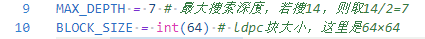
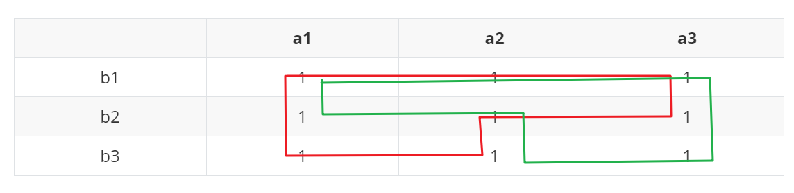

2020中兴捧月算法大赛的个人题解 仅供参考

# 算法原理说明

## 运行环境

### Python版本

Python3.7.1

### 第三方依赖库

- numpy 1.18.2
- pandas 1.0.3

### 适用条件

1. 关系文件 `Example.csv `与代码在同一目录下

2. 关系文件 `Example.csv`符合QC-LDPC码的构造

   - 比如：第一阶段所给出的`Example.csv` 符合QC-LDPC码构造：其母矩阵大小为4×10，其中每个循环子矩阵大小为64×64

3. 代码中有两个常量，请根据需要调节，如下图：

   

   - `MAX_DEPTH` ：表示最大搜索深度，由于采用双向搜索，需要将实际的最大搜索深度除以2
     - 比如：若最多需要搜索有14个名字的祭品数目，需要将`MAX_DEPTH` 改为7
     - 根据题目要求，目前最多支持`MAX_DEPTH` = 14
   - `BLOCK_SIZE` ：表示QC-LDPC码子矩阵的大小
     - 比如：`Example.csv` 中QC-LDPC码子矩阵大小为64，则`BLOCK_SIZE` 大小为64

   > 注：由于自适应判断子矩阵大小的算法适应性有待提高，且耗时不短，这里仅仅根据1，2阶段的数据量来判断`BLOCK_SIZE`取值，没有做到自动判断`BLOCK_SIZE`的大小

## 算法原理

### 题目理解

题目的意思实际上就是需要找环，这个环的意思有两种理解方法：

- 第一种：这是比较常见的理解，就是指祭品从`a`部落的`a1`开始传递，不重复地回到自己的手中，这也是题目中直接给出的理解方式。

- 第二种：如对于如下这样的表示`a b`两个部落关系的矩阵，将其中为1的地方看作一个点。“环“的意思是从某点沿横向或纵向移动，最终回原点所形成的环。
  - 需要注意的是，每次移动后必须换方向，如第一次`(a1,b1)->(a1,b3)`为纵向移动，第二次必须横向移动，即只能前往`(a2,b3)`或`(a3,b3)`

|      | a1   | a2   | a3   | a4   | a5   |
| ---- | ---- | ---- | ---- | ---- | ---- |
| b1   | 1    |      | 1    | 1    |      |
| b2   |      | 1    |      | 1    |      |
| b3   | 1    | 1    | 1    |      |      |
| b4   | 1    |      |      | 1    | 1    |
| b5   | 1    |      | 1    |      |      |

比如，对于上述矩阵：

- 按照第一种理解`a1->b3->a3->b1->a1`是一个环

- 按照第二种理解`(a1,b1)->(a1,b3)->(a3,b3)->(a3,b1)->(a1,b1)`是一个环

> **对于本题而言，以上这两种对于“环”的理解实际上是完全等价的，我认为第二种理解更有利于算法的实现，所以按第二种理解来编写程序，下面的算法部分都是基于第二种理解进行展开。**

### 算法实现

算法分为两部分，一部分是遍历算法，另一部分是去重算法，下面分这两部分进行说明。

#### 遍历算法

遍历算法最基本的框架是递归地DFS，下面顺着我算法版本迭代的思路来说明最终的算法。

##### DFS

首先是最基础的DFS：暴力地搜索从`(rol,col)`点开始，沿纵向出发，经过所要求的`MAX_DEPTH*2`步回到起点的路径数，其框架如下：

```python
def DFS(row,col,direction):
    '''
    row表示当前搜索坐标第row行，col表示当前搜索坐标第col列
    direction: 值为0, 1分别表示按行搜索和按列搜索
    '''
```

基本逻辑：

1. 首先判断递归是否结束

   递归结束的条件有2个：

   - 搜索到了起点：对应当前栈深的路径数+1
   - 搜索到达了所要求的最大栈深仍未回到起点

2. 若递归不结束，根据传入的`direction`判断按行搜索或按列搜索

   - 若`direction = 0 `，表示按行搜索，即在关系矩阵中`row`行找到一个为1的块，进一步递归
   - 若`direction = 1 `，表示按行搜索，即在关系矩阵中`col`行找到一个为1的块，进一步递归

3. 在主程序中，每一点搜索完成后，直接对关系矩阵中这一点的值置零，表示进过该点的值都已经搜索过

> 这种暴力DFS的方法应该是大家普遍最先想到的，这种方法实现的算法，在没有进一步优化的情况下，搜索到10个祭品的时就需要30min，效率很低。

##### 双向DFS

在前述DFS的基础之上，进一步得到双向DFS：从`(row,col)`点开始，沿横向纵向同时出发，同时进过`MAX_DEPTH`步，最终相遇的点进行拼接。

由于横向纵向的搜索不能同时进行，所以必须对其一进行存储，在我的代码中，我选择**对横向搜索的所有结果进行存储**。

基本逻辑：

- 首先判断递归是否结束

  递归结束的条件有2个：

  - 搜索到了起点

  - 搜索到达了所对应的栈深`{4,6,8,10,12,14}`仍未回到起点：

    - 若最初是沿横向出发，记录当前路径到字典`track_dict`中

      **key**:(当前行，当前列，当前位置第几次到达, 到达时的栈深) 

      **value**:每次搜索到的track_list

    - 若最初是沿纵向出发，将当前搜索到到达该点的路径与字典中沿横向出发到达该点的几条路径一一匹配，存入结果集合

- 若递归不结束，根据传入的`direction`判断按行搜索或按列搜索

  - 若`direction = 0 `，表示按行搜索，即在关系矩阵中`row`行找到一个为1的块，进一步递归
  - 若`direction = 1 `，表示按行搜索，即在关系矩阵中`col`行找到一个为1的块，进一步递归

- 在主程序中，先进行横向搜索，后进行纵向搜索

> 双向DFS会引入重复，需要去重，去重原理在去重算法中说明

##### 结合QC-LDPC码特点的双向DFS

在前述双向DFS的基础上，进一步得到结合QC-LDPC码特点的双向DFS：不需要遍历每一个`(row,col)`，只需要对第`0, 0+BLOCK_SIZE, 0+2*BLOCK_SIZE, ...`行的元素进行搜索，并复制`BLOCK_SIZE`份（乘上`BLOCK_SIZE`）即可。

> 利用QC-LDPC码特点也会引入重复，所以需要去重，这一部分的原理将在去重算法中说明。

#### 去重算法

首先需要明确本算法会带来哪些重复（这里的重复不止指重复计算，也指前面搜索到的不满足要求的环）：

- 由于顺序不同而带来的重复：

  - 比如，`(a1,b1)->(a1,b3)->(a3,b3)->(a3,b1)->(a1,b1)`和`(a1,b1)->(a3,b1)->(a3,b3)->(a1,b3)->(a1,b1)`，虽然点的排列顺序不同，但横纵坐标的集合完全一致

- 由于虽然从点的角度来看没有问题，但是将其对应的横纵坐标提取出来发现是一样的：

  - 比如，对于下面的关系矩阵，`(a1,b1)->(a1,b2)->(a2,b2)->(a2,b3)->(a3,b3)->(a3,b1)->(a1,b1)`和`(a1,b1)->(a1,b3)->(a2,b3)->(a2,b2)->(a3,b2)->(a3,b1)->(a1,b1)`分别以绿色和红色标出，可以看到，虽然路径不同，但转换到最终需要的结果上，二者一致

    

- 双向DFS引入的重复（这一部分的重复实际上是指无效短环）：

  - 比如，横向搜索和纵向搜索都搜索到了`a2`这一行，假设分别为`(a2,b1)(a2,b2)`，这样虽然每个点都没有重复利用，但是在提取完行列坐标后，会发现其实这一祭品在中间遇到两次a2后，本应直接停止，所以其实是不满足要求的。
- 利用QC-LDPC码时引入的重复

  - QC-LDPC码引入的重复是因为，如果通过`(a1,b1)`点的路径同时也通过了`bBLOCK_SIZE`行的点，那么在将该路线平行向下移动时，原本经过`aBLOCK_SIZE`行的点会经过`b1`行，但是进过`b1`行的所有路线之前都已经搜索过了，这就会引起重复计算。

下面说明每种重复对应的去重方法:

- 对于前面两种重复，去重方法是一样的，归根结底是需要将路径存储下来，判断两两是否相同。

  由于python中的集合set中不允许有重复元素出现，在往set中加元素时，会自动去重。所以只需要将路径按从小到大排序后加入set即可

- 对于双向DFS引入的重复，只需要对所有存储的路径进行遍历，如果路径长度不满足要求（如要求长度14，而搜索到的路径长度为13）则无效短环数+1

- 对于利用QC-LDPC码引入的重复，每`BLOCK_SIZE`行为一个周期来进行去重

  - 比如：搜索完`b0`行所有为1的元素后，对于搜索到的每一个路径结果，判断其与`1~BLOCK_SIZE-1`的交集，计将交集中最大的元素出现次数+1

  - 对于`BLOCK_SIZE` = 64的情况，进一步说明：

    - 对于每一个路径结果（以元组形式存储）首先判断其中是否有63：
      - 若有则将第0行的结果迁移到第1行将产生的重复数:`duplicate_count[0]`加1
      - 若无，再判断其中是否有62:
        - 若有则将第1行的结果迁移到第2行将产生的重复数:`duplicate_count[1]`加1
        - 若无，再判断其中是否有61
          - ...

    以此类推，由于`duplicate_count[n]`是基于`duplicate_count[n-1]`的基础上往下推的，所以最后的重复数要乘上一个权重，即`[63,62,62,...,1]`，两者相乘相加即为总的重复数。

### 进一步的优化

- 暂时没能想到进一步的优化方法，或许可以在剪枝上进行优化

## 测试步骤

1. 关系文件 `Example.csv `与代码在同一目录下

2. 根据**适用条件**-3中所述，调节 `MAX_DEPTH` 和 `BLOCK_SIZE` 两个常量

   > 注意：对于初赛两个阶段的数据，直接运行即可，无需调节任何参数

3. 运行代码，在TERMINAL可以看到代码运行时间和计算结果，在同一目录下的result.txt中也可以看到计算结果

4. 经测试，正常情况下，对于第一阶段所给出的测试用例，得到全部结果的时间应当<10s；对于第二阶段所给出的测试用例，得到全部结果的时间约1分钟

## 版本更新

1. v0：第二阶段初次提交，可适应1，2阶段的数据
2. v1：第二阶段初次修改，优化了一些细节
3. v2：优化了一些细节